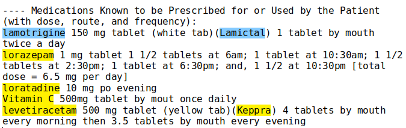

<!--
%\VignetteEngine{knitr::rmarkdown}
%\VignetteIndexEntry{3. Customizing the drug_list argument in medExtractR}
%\VignetteEncoding{UTF-8}
-->

```{r setup, include = FALSE}
knitr::opts_chunk$set(R.options = list(width = 90))
```

Generally, the function call to `medExtractR` is  

```{r, eval = FALSE}
note <- paste(scan(filename, '', sep = '\n', quiet = TRUE), collapse = '\n')
medExtractR(note, drug_names, unit, window_length, max_dist, ...)
```

where `...` refers to additional arguments to `medExtractR`. One of the key additional arguments is `drug_list`.

- `drug_list`, a list of other drug names (besides the drug names of interest). This list is used to shorten the search window in which `medExtractR` looks for dosing entities by truncating at the nearest mentions of a competing drug name. By default, this calls `rxnorm_druglist`, a partially cleaned and processed list of brand name and generic drug names in the RxNorm database.$^{1}$ This list could also incorporate other competing information besides drug names, such as drug abbreviations, symptoms, procedures, or names of laboratory measurements.

The default `rxnorm_druglist` contains far more drug names than likely needed. This results in slow run times for both `medExtractR` and `medExtractR_tapering`. This vignette will demonstrate how to create your own `drug_list` for improved performance.

```{r}
library(medExtractR)
# note file names
fn <- c(
  system.file("examples", "tacpid1_2008-06-26_note1_1.txt", package = "medExtractR"),
  system.file("examples", "tacpid1_2008-06-26_note2_1.txt", package = "medExtractR"),
  system.file("examples", "tacpid1_2008-12-16_note3_1.txt", package = "medExtractR"),
  system.file("examples", "lampid1_2016-02-05_note4_1.txt", package = "medExtractR"),
  system.file("examples", "lampid1_2016-02-05_note5_1.txt", package = "medExtractR"),
  system.file("examples", "lampid2_2008-07-20_note6_1.txt", package = "medExtractR"),
  system.file("examples", "lampid2_2012-04-15_note7_1.txt", package = "medExtractR")
)
getNote <- function(x) paste(scan(x, '', sep = '\n', quiet = TRUE), collapse = '\n')
notes <- vapply(fn, getNote, character(1))
```

Here's an example run with the last note (note 7). We're using the default argument for drug_list, the full RxNorm data.

```{r}
medExtractR(note = notes[7], drug_names = c("lamotrigine", "lamictal"),
  window_length = 130, unit = "mg", drug_list = "rxnorm")
```

Let's take a look at this note. We want to extract entities associated with the drugnames highlighted in blue (i.e., "lamotrigine", "lamictal").
Note that there are several drug names (yellow highlighted) which should be recognized by medExtractR in order not to extract irrelevant
entities not associated with the drug of our interest.



To let medExtractR recognize drugs that are not of our interest, we need to provide a list of drugs. Unless specified otherwise, we use the list of drugs in the
RxNorm database (`druglist = "rxnorm"`). You can examine this druglist by loading `rxnorm_druglist`.

```{r}
data(rxnorm_druglist, package = 'medExtractR')
length(rxnorm_druglist)
head(rxnorm_druglist)
```

We can pass the full druglist directly to `medExtractR`. Note that the result will be equal to the previous example.

```{r}
medExtractR(note = notes[7], drug_names = c("lamotrigine", "lamictal"),
  window_length = 130, unit = "mg", drug_list = rxnorm_druglist)
```

We can even set `drug_list` to be empty (with NULL), though this would lead to many false positives.

```{r}
medExtractR(note = notes[7], drug_names = c("lamotrigine", "lamictal"),
  window_length = 130, unit = "mg", drug_list = NULL)
```

In this case, adding the drug "lorazepam" will correct our output.

```{r}
medExtractR(note = notes[7], drug_names = c("lamotrigine", "lamictal"),
  window_length = 130, unit = "mg", drug_list = 'lorazepam')
```

Before running `medExtractR` we can search for drugname values present in our notes. If we restrict our `drug_list` to only these values, the `medExtractR` function will run much faster. To do this, we can use the `string_occurs` function. The first argument is a vector of character strings to find (i.e., the full drug list). The second argument is a vector of text to search (i.e., all of our notes). This function also has an argument for ignoring case (`ignore.case`) as well as the number of cores available for parallel processing (`nClust`, which requires the `parallel` package).

```{r}
parallel::makeCluster(2, setup_strategy = "sequential")
drug_check <- string_occurs(rxnorm_druglist, notes)
names(drug_check)
lengths(drug_check)
fnd_drugs <- drug_check[['TRUE']] # or, drug_check[[1]]
fnd_drugs
medExtractR(note = notes[7], drug_names = c("lamotrigine", "lamictal"),
  window_length = 130, unit = "mg", drug_list = fnd_drugs)
```

Additionally, we may want to search for potential drugname misspellings in our data. If we find any, we can add these to our `drug_list`. We can look for misspellings with the `string_suggestions` function. Its output should be manually reviewed as many of its suggestions should be discarded. 

```{r}
sug_drugs <- string_suggestions(fnd_drugs, notes)
sug_drugs
```

In this case, it finds two values we should include.

```{r}
all_drugs <- c(fnd_drugs, sug_drugs[,'suggestion'])
medExtractR(note = notes[7], drug_names = c("lamotrigine", "lamictal"),
  window_length = 130, unit = "mg", drug_list = all_drugs)
```

## References  

1. Nelson SJ, Zeng K, Kilbourne J, Powell T, Moore R. Normalized names for clinical drugs: RxNorm at 6 years. Journal of the American Medical Informatics Association. 2011 Jul-Aug;18(4)441-8. doi: 10.1136/amiajnl-2011-000116. Epub 2011 Apr 21. PubMed PMID: 21515544; PubMed Central PMCID: PMC3128404.
